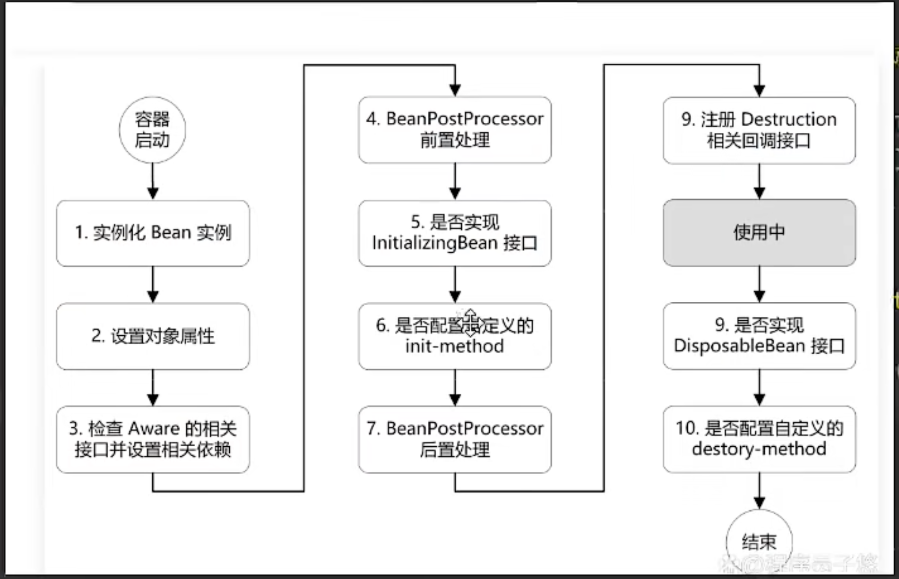

# 什么是Spring框架

轻量级javaee 框架
主要解决企业应用中的复杂问题
loc  aop  数据访问/集成层
ioc 提供了一种横向关注点的处理：比如 事物管理  安全检查  缓存等
数据访问层 提供了不同数据库持久化技术的实现，比如jdbc  orm nosql
模块： 
数据集成  ： jdbc orm oxm jms 事物
web ： websocket servlet  web  portiet
aop  aspect ..
Beans Core  Content  Spel
生态  基石

# spring有哪些优点？
轻量级：Spring在大小和透明性方面绝对属于轻量级的，基础版本的Spring框架大約只有2MB。
控制反转（IOC）：Spring使用控制反转技术实现了松耦合。依赖被注入到对象，而不是创建或寻找依赖对象。
面向切面编程（AOP）：Spring支持面向切面编程，同时把应用的业务逻辑与系统的服务分离开来。
容器：Spring包含并管理应用程序对象的配置及生命周期。
MVC框架：Spring的web框架是一个设计优良的web MVC框架，很好的取代了一些web框架。
事务管理：Spring对下至本地业务上至全局业务（JAT）j提供了统一的事务管理接口。
异常处理：Spring提供一个方便的AP\将特定技术的异常（由）DBC, Hibernate，或DO抛出）化为一致的、
Unchecked异常。

# 什么是控制反转
控制反转是应用于软件工程领域中的，在运行时被装配器对象来绑定耦合对象的一种编程技巧 
对象之间耦合关系在编泽时通常是未知的。在传统的编程方式中，业务逻辑的流程是由应用程序中的早已被设定好关联关系的对家来决定的。
在使用控制反转的情况下，业务逻辑的流程是由对象关系图来决定的，该对象关系图由装配器负责实例化，这种实现方式还可以将对象之间的关联关系的定义抽家化。而绑定的过程是通过"依赖注入”实现的。

控制反转是一种以给予应用程序中目标组件更多控制为目的设计范式，并在我们的实际工作中起到了有效的作用。

依赖注入是在编译阶段尚未知所需的功能是来自哪个的类的情况下，将其他对象所依赖的功能对象实例化的模式。
这就需要一种机制用来激活相应的组件以提供特定的功能，所以依赖注入是控制反转的基础。
否则如果在组件不受框架控制的情况下，框架又怎么知道要创建哪个组件？

在ava中依然注入有以下三种实现方式：

1.构造器注入

2.Setter方法注入

3.接口注入

--- 

Spring的1OC，即Inversion of Control，也就是控制反转，是Spring框架的核心特性之一，其主要思想是将原本在代码中直接操控的对象的调用权交给Spring容器来管理，从而降低了代码之间的耦合庹，提高了程序的可维护性和可扩展性。

在传统的ava开发中，我们通常在代码中直接new—个对象来调用其方法。但这种方式会导致代码之间的耦合度过高，一旦某个类发生改变，可能会影响到很多其他的类。而Spring的1OC解决了这个问题，它将对象的创建和生命周期管理交给了Spring容器来负责。我们只需要在配置文件中配置好相应的Bean，然后就可以在需要的地方通过 Spring容器来获取这个Bean，而不需要关心它的创建和销毁过程。

# 什么是依赖注入

# 描述下bean的生命周期？
1、实例化bean：反射的方式生成对象
2、填充bean的属性：populateBean（），循环依赖的问题（三级缓存）
3、调用aware接口相关的方法：invokeAwareMethod（完成BeanName,BeanFactory,BeanClassLoader对象的属性设置）
4、调用BeanPostProcessor中的前置处理方法：使用比较多的有 （ApplicationContextPostProcessor，设置
ApplicationContext Envronment.Resourceloader.Embeda ValueResover等对象）
5、调用initmethod方法：invokelnitmethod0.判断是否实现了initializingBean接口，如果有，调用 afterPropertiesSet方法，没有就不调用
6、调用BeanPostProcessor的后置处理方法：spring的aop就是在此处实现的，AbstractAutoProxyCreator
注册Destuction相关的回调接口：钩子函数
7、获取到完整的对象，可以通过getBean的方式来进行对象的获取
8、销毁流程，1；判断是否实现了 DispoableBean接口，2，调用destroyMethod方法

# 解释下自动装配的各种模式 
自动装配提供5种不同的
1.no ：默认的方式，不进行自动装配，通过ref 标签指定依赖对象
2.byName：根据属性名称进行自动装配，Spring容器会根据属性名称在配置文件中查找相应的Bean，并将其注入到目标Bean中
3.byType：根据属性类型进行自动装配，Spring容器会根据属性类型在配置文件中查找相应的Bean，并将其注入到目标Bean中
4.constructor：通过构造方法进行自动装配，Spring容器会根据构造方法的参数类型在配置文件中查找相应的Bean，并将其注入到目标Bean中
5.autodetect：Spring容器首先通过构造方法进行自动装配，如果无法通过构造方法进行自动装配，则通过byType进行自动装配

# beanfactory 和ApplicationContext的区别
1.beanfactory 是spring的根接口，ApplicationContext是BeanFactory的子接口，也是BeanFactory的扩展，提供了更多的功能。
2.beanfactory 是延迟加载，ApplicationContext 是立即加载
3.beanfactory 不支持国际化，ApplicationContext 支持国际化
4.beanfactory 不支持监听器，ApplicationContext 支持监听器
5.beanfactory 不支持应用事件，ApplicationContext 支持应用事件
6.beanfactory 不支持多语言环境，ApplicationContext 支持多语言环境
7.beanfactory 不支持主题，ApplicationContext 支持主题
8.beanfactory 不支持资源加载，ApplicationContext 支持资源加载
9.beanfactory 不支持事件发布，ApplicationContext 支持事件发布

# 什么是spring的aop
aop 是面向切面编程，是一种编程范式，它允许我们将应用程序中的横切关注点（如日志记录、事务管理、安全检查等）与业务逻辑分离，从而提高代码的复用性和可维护性。

# 什么是aop
aop 是面向切面编程，是一种编程范式，它允许我们将应用程序中的横切关注点（如日志记录、事务管理、安全检查等）与业务逻辑分离，从而提高代码的复用性和可维护性。
